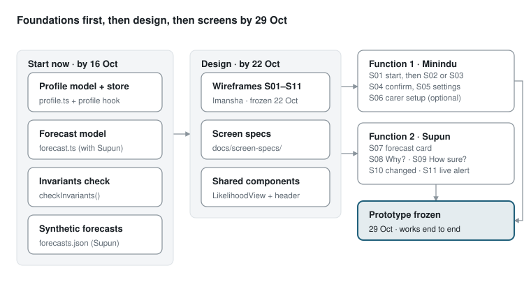

# Prototype Build Plan

Minindu Abeywardena · 5 October 2026 · Shared doc: https://claude.ai/code/artifact/8821e865-3a91-419b-9d52-35e5472e3d20

Both prototype functions must work end to end on a phone with synthetic data by 29 October. Screens wait for wireframes, but the data model, the invariants check and the shared components can start today.

## Start now

The rule "no screen without its wireframe and spec" covers screens only. Four pieces sit under the screens, need no wireframe, and every screen depends on them, so build them first. They are also Task 7 (data model, due 16 Oct).

| # | Piece | File | What it holds | Owner | Unblocks |
| --- | --- | --- | --- | --- | --- |
| 1 | Profile model | `ews-mobile/model/profile.ts` | One field per template question: likelihood form, detail on first view, action detail, reminders and change alerts, time and place wording, modality and reading level, explanation goal. Plus the three ready profiles as preset values, and carer consent. | Minindu | S01–S06 |
| 2 | Forecast model | `ews-mobile/model/forecast.ts` | Hazard, place, time window, probability, CAP certainty word, severity class, action, previous level, next update time, supporting observations, `synthetic: true`. Agree the JSON shape with Supun. | Minindu + Supun | S07–S11, synthetic data |
| 3 | Invariants check | `ews-mobile/model/invariants.ts` | A function that takes an adapted explanation and returns pass or the list of missing invariants (hazard, place, time window, likelihood, action). | Minindu | Every forecast screen; the framework's worked trace |
| 4 | Profile store | `ews-mobile/contexts/ExplanationProfileContext.tsx` | Loads and saves the profile with AsyncStorage, the same way `UserPreferencesContext` does today, and exposes `useExplanationProfile()`. | Minindu | S02–S05, every forecast screen |

Alongside these, Supun can write `ews-mobile/data/synthetic/forecasts.json` once the forecast model is agreed. It needs two forecasts for the same gauge, yesterday and today, so S10 has a change to show.

The existing app keeps its condition picker (`app/onboard/impairment.tsx`). Whether to drop it is an open question for Madam, so the new profile sits beside it for now.

## Build order

The foundations and the wireframes run in parallel this week and next. Screens start once both are in place, and both functions must be working end to end by the 29 Oct freeze, so the walkthrough can start on 30 Oct.

## Your screens: S01–S06

All six read or write the profile model, so they come after "Start now". Wireframes are with Imansha; each spec goes in `docs/screen-specs/` before any code.

| Screen | Issue | Reads / writes | Decide in the wireframe | Guidelines to check |
| --- | --- | --- | --- | --- |
| S01 Profile setup start | #1 | Nothing yet; routes to S02 or S03 | How long setup takes, said up front; one choice per button | G4, G42, G84 |
| S02 Profile question | #2 | Writes one profile field per screen | One template for all seven questions; picture options; "Not sure, choose for me" default; "Ask my helper" | G4, G26, G41, G47, G128 |
| S03 Ready-made profile picker | #3 | Writes a preset profile | The three names by need; a small sample forecast under each | G84, G57 |
| S04 Profile summary and confirm | #4 | Reads the whole profile | A sample forecast shown in the chosen profile; "you can change this in Settings" | G58, G50 |
| S05 Settings: "How we explain" | #5 | Reads and writes the profile | Switch preset or redo questions; used in walkthrough task T2 | G58 |
| S06 Carer-assisted setup (optional) | #6 | Writes the profile and a consent record | Consent screen first; first on the cut list if time runs short | G107, G80 |

S02 is the biggest: one screen template drives seven questions, so build it once and feed it the question text and options from data. The seven questions are in the Research Approach, Task 3.

## Shared pieces

These are used by several screens on both sides, so agree who builds each one before screens start. Build them as components in `ews-mobile/components/`, with colours only from `theme/colors.ts`.

| Component | What it does | Used by | Suggested owner |
| --- | --- | --- | --- |
| `LikelihoodView` | Renders the profile's likelihood form: CAP word, icon array of 10 houses, exact figure on tap; with a screen-reader label ("3 of 10 houses filled") | S03, S04, S07, S09 | Supun |
| `ForecastHeader` | The fixed header with place, time window and the "Synthetic data" label | S07–S10 | Supun |
| `useExplanationProfile()` | Reads the current profile from the profile store | Every screen | Minindu |
| `checkInvariants()` | Pass or the list of missing invariants; run before any adapted explanation is shown | S07–S11 | Minindu |
| `ProfileQuestion` | The S02 template: question, picture options, default, helper option | S02 | Minindu |

S03 and S04 show a sample forecast, so they reuse `LikelihoodView` too. That is the one place your screens depend on Supun's work.

## Done when

A screen merges into `main` only when all of these hold. The same list is in the screen issue template.

- [ ] Wireframe and spec linked from the issue
- [ ] Built with the prompt in `docs/ai-prompting-template.md`, one screen per prompt
- [ ] Matches the wireframe, checked in Expo Go on a phone
- [ ] Works in all three profiles
- [ ] Forecast screens show all five invariants and pass `checkInvariants()`
- [ ] Every control has a screen-reader label; touch targets at least 48 dp
- [ ] `npm run typecheck` and `npm run colors:audit` pass
- [ ] The person who built it does not lead its walkthrough

## Open questions

- [ ] Supun: the forecast JSON shape. Does it carry supporting observations for "Why?", or only feature values we translate?
- [ ] Supun: who builds `LikelihoodView` and `ForecastHeader`, and by when?
- [ ] Imansha: wireframe order. Can S02 and S07 come first, since they carry the most?
- [ ] Madam (15 Oct meeting): keep the existing condition picker beside the new profile, or replace it?
- [ ] Team: Sinhala and Tamil text for the screens now, or after the English is frozen?
