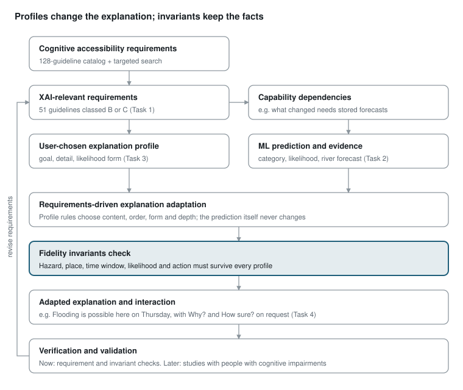

# Profile-Based Adaptive XAI for Cognitive Accessibility — Research Approach

Sep 29, 2026 · @Minidu

## Summary (version 3, 4 Oct 2026)

We will write an **8-page full paper** for UISE 2027: a requirements-driven way to adapt the explanation of a flood ML prediction to a user-chosen explanation profile. It is built as a React Native prototype and evaluated with a persona-based cognitive walkthrough.

**What changed from version 2**

- Task 1 triage is now Minindu's manual evaluation of all 128 guidelines, not a first-pass proposal.
- The guideline tables moved to a separate evidence catalogue, with how each guideline is adapted in our flood EWS app and the published evidence for it.
- 19 guidelines from the manual review of the catalogue were added to the 31 from the first triage (50 in total); none was removed.

**What changed from version 1**

- **Paper type:** 5-page vision paper → 8-page full paper, because we now build and evaluate a prototype.
- **Prediction types are grounded:** chosen from the literature and from deployed AI flood systems (Google Flood Hub), not picked by us.
- **New motivation study:** we run SHAP, LIME and a counterfactual on a synthetic flood model and show which of our guidelines their output fails.
- **Profile questions are grounded:** built from the cognitive domains in standard screening tools and from validated self-report scales, not from the tests themselves (see Task 3 for why).
- **Three profiles are justified** from existing apps (Competitive Analysis 04) and prior XAI work.
- **Prototype:** two functions (set up / select profile; view prediction), wireframes first, then AI-assisted build on our existing React Native EWS app, same colours as v2.
- **Evaluation:** cognitive walkthrough with personas built from the three profiles. Evaluators record problems in plain words; we map them to guidelines afterwards.

**Unchanged:** keep the uncertainty ("Possible", not deleted), profiles by need not diagnosis, fidelity invariants as the core SE idea, Brief 2 (Vedda) stays a separate paper.

The schedule and owners are in the separate plan doc, "Adaptive XAI Paper — Feasible Plan to 13 Nov".

## Research question and scope

**Central question (Brief 1):** How can cognitive accessibility requirements be identified, represented as XAI preference profiles, and used to adapt the explanation of disaster-related ML predictions?

**Sub-questions:**

1. Which existing cognitive accessibility requirements are relevant to XAI?
2. Which disaster ML prediction types create different explanation requirements?
3. How can XAI profiles determine explanation content, detail and interaction?

**Motivating example.** A standard output reads: "In two days there is a 30% chance your area will flood due to current weather." For someone with a cognitive impairment this may be hard to process: a percentage, a relative time, an implied location and no action. The adapted version keeps every fact but changes order, form and depth. A worked example is under Task 3.

**In scope**

- People with cognitive impairments (dementia, MCI, autism, ADHD and others), described by explanation *needs*, not diagnosis.
- One or two flood prediction types, with synthetic values clearly labelled.
- A literature-grounded requirements synthesis, profile specification, Figma demonstration and framework.

**Out of scope for this paper**

- Changing the ML model or its prediction.
- Claims of validation with users (no study has been run).
- Indigenous communities such as the Vedda. Their needs (source, provenance, time period, community governance) are a different problem, covered by Research Brief 2 as a separate paper.

## Positioning and the gap

XAI for people with cognitive disabilities already exists, so our novelty has to be the combination of safety-critical predictions, a requirements process and fidelity checking.

| Work | What it does | What it leaves open for us |
| --- | --- | --- |
| [NeuroAdaptX (Bunde, DESRIST 2026)](https://link.springer.com/chapter/10.1007/978-3-032-28316-0_12) | Adapts explanation structure, modality and density to self-reported profiles (ADHD, autism, dyslexia); RCT, N=216; keeps explanation content the same | Closest competitor. No safety-critical or disaster setting, no RE process, adapts presentation only. Must be cited and contrasted. |
| [Tielman et al., "Explainable AI for all" (Technology in Society, 2024)](https://www.sciencedirect.com/science/article/pii/S0160791X24002331) | Roadmap for inclusive XAI for people with cognitive disabilities; recommends personalised, adaptive explanations | No disaster domain, no requirements specification or profile structure |
| [ProfileXAI (Corrales et al., 2025)](https://arxiv.org/html/2510.22998) | SHAP/LIME/Anchor + LLM explanations for three user types (ML engineer, domain expert, lay user) | Profiles by expertise, not accessibility; healthcare |
| [Accessible XAI survey (arXiv 2407.17484)](https://arxiv.org/abs/2407.17484) | Surveys accessibility of XAI, mostly visual impairment | Cognitive accessibility under-covered |
| Madugalla et al. (2025), human-centred RE for disaster EWS | RE process for disaster EWS apps | Explicitly leaves cognitive impairment out; no XAI |
| Our earlier paper | RE process + prototype for cognitively accessible EWS | Warns and guides evacuation, but never explains a prediction |

**Gap statement for the paper:** no work turns cognitive accessibility requirements into explanation requirements for safety-critical ML predictions, specifies them as user-chosen profiles, and checks that adapted explanations stay faithful to the prediction.

**Differentiation from NeuroAdaptX in one line:** they show presentation adaptation helps comprehension; we specify *what* must be explained, what software capability each explanation need depends on, and what can never be dropped in a safety-critical warning.

## What our earlier work already shows

Across our paper, interim report, four competitive analyses, 128-guideline catalog and prototype, nothing explains a prediction. This is the new gap, and our own material is the evidence for it.

| Source | Relevant finding | Use in the new paper |
| --- | --- | --- |
| Final paper ("Designing Inclusive Disaster EWS…") | 128-item catalog from 969 guidelines / 49 sources; rule-based profiles; AI only for optional plain-language rewriting | Starting point for Task 1; the prior-work paragraph |
| Competitive Analysis 01 | 5 production EWS apps (FEMA, MyShake, Google Public Alerts, Red Cross, Disaster Alert): none cognitively accessible; plain-language threat descriptions partial or absent | Evidence that mainstream EWS output is not written for this population |
| Competitive Analysis 02 | 13 apps split into predictive EWS vs cognitive-accessibility apps; none does both | Extend the argument: even the predictive apps never explain their predictions |
| Competitive Analysis 03 | Four-layer architecture (baseline → profile rules → alert mode → optional AI); "accessibility illusion" risk of LLM simplification; only 6% of AI-in-EWS work targets dissemination | The architecture the new framework plugs into; motivation for fidelity invariants |
| Competitive Analysis 04 | UI techniques across 7 apps; MyShake shows magnitude colours, Disaster Alert map symbols, no "why" or "how sure" anywhere | Evidence for the explanation gap |
| 128-guideline catalog | Covers how to present (plain language, numbers in several forms, progressive disclosure), not what to explain | Task 1 triage (next section) |
| Prototype v2 (Figma) | Onboarding picks a condition (Dementia, Autism, MCI, ADHD, Schizophrenia); alert states Safe / Warning / Danger; danger screen says "Danger! Flood coming!" | Base for Task 4; needs a forecast state and an explanation-profile screen |

The Figma file itself could not be opened by automated tools. Prototype observations come from Figure 3.2 of the interim report and Figure 2 of the final paper.

## Task 1: Which requirements matter for XAI

Minindu manually evaluated all 128 guidelines and found 50 that affect how a prediction is explained: 31 from the first triage (10 XAI-related, 21 both) and 19 more from a second manual review of the colour-coded catalogue. The rest are general UI.

The full list is in a separate document, the [XAI guideline evidence catalogue](https://claude.ai/artifact/VFKhDQcpoD77yesowohsHx) (also exported as a PDF). For each guideline it gives the implication for the explanation, how to adapt it in our EWS app, and published evidence: 38 have direct evidence, 9 indirect, and 3 have none found and stay as our inference.

Classes follow Brief 1: **A** = general UI, **B** = XAI-related (changes what is explained or how it is understood), **C** = both. None of the 49 source papers discusses AI explanations, so every B and C implication is *inferred by us*. The paper must say this.

**Why check the evidence again.** The 128 guidelines are already sourced, but their sources answer a different question: does this help people with cognitive impairments use an interface or follow a warning? We apply them to a new object, the explanation of an ML prediction, and that transfer is our inference. The evidence catalogue tests the transfer: does any study show the property changes how people understand an AI explanation, a probability or a warning? Direct evidence supports the transfer, indirect evidence supports it only partly, and "none found" marks it as inference.

### What the catalog does not cover

The catalog explains *how* to present information, never *what* to explain. A targeted literature search is needed for:

- **Reasons and evidence:** why the risk is high, which observed conditions support it. Feature importance must not be presented as cause.
- **Uncertainty for low numeracy:** icon arrays, natural frequencies, verbal probability words and how they are misread.
- **Forecast change over time:** explaining upgrades and downgrades.
- **Source and provenance:** who issued the forecast and from what data.
- **False alarms and trust:** explaining a flood that did not happen so the next warning is still heeded.
- **Impact-based framing:** what the flood will *do* to the user, not what the weather will *be* (WMO impact-based forecasting).
- **Fidelity of simplified text:** checking an Easy Read or LLM version keeps the facts.

## Task 2: Prediction types, grounded in literature and deployed AI

We choose the two output types that the leading deployed AI flood system actually produces: a **severity class** and a **multi-day river forecast with uncertainty**. That makes the choice defensible rather than ours.

### Evidence from deployed AI systems

| System | Model | What it outputs | Type it supports |
| --- | --- | --- | --- |
| [Google Flood Hub (Nearing et al., Nature 2024)](https://www.nature.com/articles/s41586-024-07145-1) | LSTM encoder–decoder; inputs ECMWF weather, satellite rain, basin attributes | Daily streamflow up to 7 days, as a probability distribution; events judged against 1-, 2-, 5-, 10-year return periods; >80 countries; CAP alerts and push notifications | Time-series forecast with uncertainty |
| [Flood Hub API (as documented by a third-party client)](https://github.com/TAK-NZ/etl-floodhub) | Same | Gauge severity: NO\_FLOODING / ABOVE\_NORMAL / SEVERE / EXTREME; trend; 8-day forecast; inundation polygons graded HIGH / MEDIUM / LOW | Risk classification; spatial prediction |
| MyShake (Competitive Analysis 03) | Neural network on phone accelerometers | Earthquake vs everyday motion, then alert | Event classification |
| Sri Lanka Irrigation Department river gauges | Threshold rules (not ML) | Alert / minor flood / major flood levels | The local warning vocabulary users already hear (**to verify**) |

### Evidence from literature

- Nearing et al. (2024) above: the main citation; shows AI forecasts reaching the public with uncertainty available.
- Mosavi, Ozturk & Chau (2018), "Flood prediction using machine learning models: literature review", *Water*: classification and time-series regression as the dominant ML flood output types (**from memory; Imansha to confirm**).
- Recent XAI flood studies apply SHAP to flood susceptibility models, e.g. [this 2025 study](https://www.sciencedirect.com/science/article/pii/S2590123025020481), which shows feature attribution is the standard explanation in this domain.

### Choice and rationale

| Prediction type | Chosen? | Why |
| --- | --- | --- |
| Risk classification | Yes | Flood Hub's severity classes; maps directly to CAP severity and local warning levels |
| Time-series forecast | Yes | Flood Hub's core output; carries uncertainty and change between forecasts |
| Spatial prediction | Future work | Needs maps, which are hard for this population; adds a third explanation problem |
| Event likelihood (landslide) | Out of scope | Different hazard; keep one hazard for the paper |

**Scenario (synthetic, labelled in the app):** a Flood Hub–style forecast for one Sri Lankan river gauge: a 30% chance of reaching SEVERE (exceeding the danger level) in two days, upgraded from ABOVE\_NORMAL yesterday.

## Task 2b: What standard XAI gives vs what our guidelines need

This study motivates the framework: we run the standard XAI methods on the same flood prediction and show which explanation requirements their output does not meet.

**Method**

1. Train a small model on a synthetic or public flood dataset (inputs such as 72-hour rainfall, upstream level, soil moisture; output = flood class + probability).
2. Explain one prediction (the 30% case) with **SHAP** (Lundberg & Lee, 2017), **LIME** (Ribeiro et al., 2016), a **counterfactual** (Wachter et al., 2017) and optionally **Anchors** (Ribeiro et al., 2018).
3. Record each method's raw output exactly as produced, as a paper figure.
4. Score each output against the B-class guidelines and the five invariants.

**Expected shape of the result** (to be replaced with real outputs):

| Need (guideline) | SHAP | LIME | Counterfactual | Our adapted explanation |
| --- | --- | --- | --- | --- |
| Bottom line first (G21) | No: list of feature weights | No | Partly | Yes |
| Likelihood without numeracy (G26, G119) | No: raw probability, log-odds | No | No | "Possible" + 3 of 10 picture |
| Place and time window (G73) | No | No | No | "Here, Thursday" |
| Consequence and action (G50) | No | No | No | "Get your go-bag ready" |
| Familiar references (G38) | No: feature names and units | No | Partly ("if rain < 80 mm") | River vs bridge mark |
| What changed (G89) | No: single prediction only | No | No | "Yesterday this was lower" |
| Why, in plain words (G25) | Feature attribution, not cause | Local weights | Closest: a "what if" | Reasons from observations |

The point for the paper: standard XAI answers "which input features moved the model", for developers. Our guidelines need "what does this mean for me, how sure, and what do I do". That gap is why a requirements-driven adaptation layer is needed.

## Task 3: XAI profiles, grounded in literature

The standard cognitive tests cannot be used as the profile itself. Their cognitive domains, and validated self-report scales, give each profile question its literature backing.

### Can we use the Alzheimer's Association screening tools?

The [Alzheimer's Association list](https://www.alz.org/professionals/health-systems-medical-professionals/cognitive-assessment) covers patient tests (Mini-Cog, GPCOG part 1), informant tools (AD8, GPCOG part 2, Short IQCODE) and FDA-cleared digital tests. Using them directly fails on five counts:

| Problem | Evidence |
| --- | --- |
| They are diagnostic screens given by clinicians, not app setup | Mini-Cog: "healthcare provider after brief training"; results decide whether a full diagnosis is needed (Alzheimer's Association) |
| Not valid for people with intellectual disability | General dementia tests cannot separate dementia from pre-existing disability; ID-specific tools such as DSQIID are needed ([Zeilinger et al., 2022](https://www.sciencedirect.com/science/article/pii/S0891422221002973)) |
| Biased by education and language | MMSE should not be used clinically without about grade-8 education and English fluency ([MMSE overview](https://en.wikipedia.org/wiki/Mini%E2%80%93mental_state_examination)) |
| Licensing | MMSE is copyrighted and sold through PAR (same source) |
| A score measures deficit, not explanation preference | Brief 1 forbids assigning profiles from diagnosis; catalog G84 forbids labelling by condition |

**What we use instead:**

1. **The cognitive domains these tests measure** (memory, attention, executive function, orientation to time and place, language, numeracy). Each domain gives one profile question, so every question traces to a recognised domain.
2. **Validated self-report preference scales** that ask about preferences without testing ability. The model is the [Subjective Numeracy Scale (Fagerlin et al., 2007)](https://journals.sagepub.com/doi/10.1177/0272989x07304449), "measuring numeracy without a math test", which includes items on preferring numbers vs words.
3. **The informant idea** (AD8, IQCODE): a carer can answer or help, which matches G107.
4. **Function, not diagnosis:** WHO's ICF describes disability by functioning, which supports need-based profiles (**Supun to add the citation**).

### The question template

Every question follows one pattern, so one well-made question becomes the model for the rest:

> **Domain** → **explanation decision it controls** → **Easy Read question with picture options** → **"Not sure, choose for me" default** → **"Ask my helper" option**

**Worked question (numeracy → likelihood form).** Grounded in the Subjective Numeracy Scale's preference items, G26 and G119.

- Question: "When we tell you how likely a flood is, what helps you most?"
- Option A: words ("Possible", "Likely") — picture of the word card
- Option B: words and a picture (3 of 10 houses)
- Option C: words, picture and the number (30%)
- Default if unsure: B. The user can change it later.

### All questions from the template

Each question now traces to the guidelines it serves and to the published evidence behind them, from the evidence catalogue. **D** = direct evidence, **I** = indirect evidence; *new* = added in the second manual review.

| Domain (screening-test source) | Explanation decision | Question (draft) | Guidelines (evidence) | Literature backing |
| --- | --- | --- | --- | --- |
| Numeracy (SNS) | Likelihood form | When we tell you how likely a flood is, what helps you most? | G26 (D), G119 (D), G81 (D, *new*) | Icon arrays help low-numeracy and older adults (Galesic et al., 2009); probability words are read inconsistently (Budescu et al., 2009); "30% chance" is read in contradictory ways (Gigerenzer et al., 2005) |
| Attention (Mini-Cog, MoCA attention items) | Detail on first view | Do you want only the main message first, or everything at once? | G41 (D), G21 (D), G11 (D), G18 (D, *new*) | Less, focused information improves comprehension, most for low numeracy (Peters et al., 2007); complex explanations are harder to interpret (Lage et al., 2019) |
| Executive function / planning (Mini-Cog clock drawing) | Action detail | Do you want us to tell you exactly what to do, step by step? | G4 (D), G50 (D), G22 (D, *new*) | Explanations explored step by step were understood better (Mindlin et al., 2024); protective action guidance improves understanding (Sutton et al., 2021); list instructions are recalled better (Morrow et al., 1998) |
| Memory (Mini-Cog recall; AD8 "repeats questions") | Reminders and change alerts | Should we remind you of the warning and tell you if it changes? | G109 (I), G89 (D), G54 (D), G27 (I, *new*) | Earlier forecasts anchor judgments of new ones (Herdener et al., 2018); repetition helps people with dementia learn (Creighton et al., 2013); too many alerts get ignored (Ha et al., 2026) |
| Orientation to time and place (MMSE orientation) | Time and place wording | How should we say when? "Thursday morning" or "in 2 days"? | G47 (D), G73 (D), G114 (D) | Orientation and calculation are among the most impaired items in MCI and dementia (Liu et al., 2019); location in a warning changes risk judgments (Klockow-McClain et al., 2020); time indications improve understanding (Dallo et al., 2022) |
| Language | Modality and reading level | Do you like to read, listen, or see pictures? | G128 (D), G67 (D), G14 (D, *new*), G15 (I, *new*), G17 (I, *new*) | Text + visual explanations help lay users most (Szymanski et al., 2021); matching the preferred format improves understanding (Tait et al., 2012); jargon impairs processing (Bullock et al., 2019) |
| Reasoning / curiosity | Explanation goal | Do you want to know why the app thinks a flood may come? | Brief 1; G25 (D) | Adaptive XAI is the key to inclusive XAI (Tielman et al., 2024); lay users cannot be expected to read a causal chain (Miller, 2019); impact information improves warning understanding (Weyrich et al., 2018) |

### Guidelines without published backing (3)

Three of the 50 XAI-relevant guidelines were marked as possibly relevant, but the evidence search found no source linking them to understanding an explanation, forecast or warning. They stay in the requirements as **our inference**, and the paper must label them that way.

| ID | Guideline | Why it was marked | Where this document relies on it | How we treat it |
| --- | --- | --- | --- | --- |
| G20 | Include symbols and letters necessary to decipher | Sinhala and Tamil explanations must render correctly, including numerals, % and dates | Supports G121 (local-language Easy Read) | An engineering requirement: test that every explanation string renders in all three languages. Closest source is context only: CAP alerts lost integrity on small handsets in Sri Lankan trials (Waidyanatha et al., 2007), with no comprehension measure. |
| G42 | Info to prepare for a task | State the expected timing and when the next forecast update arrives | Time-window invariant (with G73); "Next update: tonight at 6 pm" in the "How sure, and what changed?" profile | The invariant stays grounded through G73, which has direct evidence. Next step: a targeted search on lead-time and update-time communication. |
| G65 | Focus Not Obscured (WCAG 2.4.11) | "Why?" and "How sure?" must never be hidden under a banner | Layout rule only | Treat as general UI (class A) in the paper; keep it in the prototype as a WCAG check. |

### Three profiles, and why these three

The profiles are bundles of default answers that the user can still change. Each bundle mirrors a pattern seen in existing apps or prior XAI work.

| Profile | Answers it bundles | Why this profile exists |
| --- | --- | --- |
| "Just tell me what to do" | Main message first; step-by-step actions; words only; listen | One-action-per-screen apps (Emergency Chat, MapHabit, GoTDAH) and calm "overwhelm mode" in Unmasked (Competitive Analysis 04); G124 |
| "Show me why" | Reasons on; words + picture; landmark comparisons | Photo/visual-step design in MapHabit and Dementia Emergency (CA04); the "why" goal in Tielman et al. 2024 and NeuroAdaptX |
| "How sure, and what changed?" | Words + picture + number; change alerts on | Countdown/time externalisation in GoTDAH, data visualisation in Unmasked (CA04); uncertainty needs in the XAI literature |

In the paper these profiles are presented as **hypothetical**, derived from literature and apps, not from users.

### Worked example: one 30% prediction, three explanations

Same synthetic prediction everywhere: moderate risk, 30% likelihood of flooding in this area in two days, upgraded from yesterday's "low".

**Standard output:** "In two days there is a 30% chance your area will be flooded due to the current weather."

**"Just tell me what to do"**

1. "Flooding is possible here on Thursday. It is not certain."
2. "Get your go-bag ready today."
3. Button: "Why?" (opens the reasons)

**"Show me why"**

1. "Flooding is possible here on Thursday."
2. "Why: a lot of rain has fallen upstream, and the river is rising."
3. River-level picture against the bridge marker (synthetic).
4. Button: "How sure is this?"

**"How sure, and what changed?"**

1. "Flooding is possible here on Thursday. 3 in 10 chance." (icon array: 3 of 10 houses filled)
2. "Yesterday this was low. It went up because of new rain."
3. "Next update: tonight at 6 pm."
4. Exact figure on tap: 30%.

All three keep the hazard, the place, the time, the likelihood and the action. Only order, form and depth change.

**Why "Possible":** as we recall, CAP 1.2 defines *Possible* as possible but not likely (p ≤ \~50%) and *Likely* as p > \~50%. That would make 30% → "Possible" a standard mapping. **To verify against the OASIS CAP 1.2 specification before citing.**

## Task 4: Prototype (React Native) from wireframes

We extend our existing React Native EWS app with two functions. Every screen is wireframed first, because AI-generated builds from text prompts alone came out generic in our earlier work.

**Function 1: Set up and select an explanation profile**

- First-time setup: the template questions, one per screen, with picture options and "Not sure, choose for me".
- Pick one of the three ready profiles instead of answering questions.
- Change the profile later from settings; carer-assisted setup (optional).

**Function 2: View a prediction and its explanation**

- A new "Forecast" state before Warning, holding "Flooding is possible here on Thursday".
- The same synthetic prediction rendered per profile; "Why?" and "How sure?" on request.
- When it becomes a live alert, every profile collapses to action only (G124).
- A "Synthetic data" label on every forecast screen.

**Build method**

1. Wireframe every screen (hand sketches or a tool such as Excalidraw or Figma).
2. Write a short spec per screen: purpose, components, text, which profile attribute it reads.
3. Prompt the AI with the wireframe image + spec + the v2 colour tokens and component list; one screen per prompt.
4. Review each generated screen against its wireframe before merging.

## Task 4b: Cognitive walkthrough

We evaluate the prototype with a persona-based cognitive walkthrough, adapting the method from our earlier paper, [Wharton et al. (1994)](https://www.nngroup.com/articles/cognitive-walkthroughs/), [IxDF guidance](https://ixdf.org/literature/article/how-to-conduct-a-cognitive-walkthrough), [Madugalla et al. (2025)](https://arxiv.org/pdf/2511.12856) and the persona-based walkthrough in [Huynh et al. (COMPSAC 2021)](https://nzjohng.github.io/publications/papers/compsac2021_1.pdf).

**Tasks** (defined from the two functions, before the walkthrough):

| ID | Task | Function |
| --- | --- | --- |
| T1 | Set up an explanation profile for the first time | 1 |
| T2 | Switch to a different ready-made profile | 1 |
| T3 | Read a new forecast and know what, where, when, how likely, and what to do | 2 |
| T4 | Ask for more explanation ("Why?" or "How sure?") and return | 2 |
| T5 | Notice that the forecast has changed since yesterday | 2 |

**Personas:** one per profile, built like our earlier evidence-record personas (affected domains, documented behaviours, urgency modifier, sources), plus an optional carer persona.

**Questions per step:** the four standard questions plus our fifth (detect and recover from an error). For T3 we add a comprehension check: can the persona state the five invariants after reading?

**Evaluator sheet (simpler than last time):**

| Column | What the evaluator writes |
| --- | --- |
| Task, step, persona | Pre-filled |
| Q1–Q5 | Yes / No |
| What went wrong | Plain words |
| Severity | 0–4 |
| Screenshot | Required for severity 3–4 |

**No guideline column.** Evaluators only describe problems; the team maps each defect to a guideline afterwards, in a separate pass.

**Bias control:** three members walk independently; the person who built a screen does not lead it; severities are rated before discussion, and agreement is reported.

## Task 5: The framework

The framework turns accessibility requirements into explanation behaviour, and checks every adapted explanation against fixed invariants before the user sees it.

Requirements flow down to a profile; each explanation need also creates a capability the system must have. Profile and prediction meet in the adaptation rules. Verification findings feed back into the requirements.

### Fidelity invariants

No profile, simplification or AI rewording may remove these.

| Invariant | Example in the scenario | Grounding |
| --- | --- | --- |
| Hazard | Flood | G11, G119 |
| Place | "Here" / your area | G73 |
| Time window | Thursday | G73, G42 |
| Likelihood (uncertainty kept) | "Possible", with picture or number per profile | G26, G119 |
| Action | Get your go-bag ready | G11, G50 |

### Requirement → capability dependencies

This is the SE contribution: an explanation need is not just a UI choice; it requires data and functions in the system.

| Explanation need | Capability the system needs |
| --- | --- |
| What changed since last time | Stored previous forecasts and a comparison |
| Why is the risk high | Model exposes supporting observations (not feature importance as cause) |
| How sure | Probability or range from the model |
| Level against a landmark | Local reference levels for each area |
| When is the next update | Forecast schedule metadata |
| Carer explanation | Consent record and a second profile |

### Fit with our four-layer architecture

- **Layer 1, baseline:** one fixed accessible explanation containing all invariants; used if everything above fails.
- **Layer 2, profile rules:** explanation adaptation lives here. It is deterministic and auditable.
- **Layer 3, alert mode:** when an alert is live, every profile collapses to action only (G124).
- **Layer 4, optional AI:** LLM wording is shown only if it passes the invariants check; otherwise the Layer 2 text is shown.

### Worked trace ("How sure, and what changed?" profile)

1. Requirement G26: provide alternatives for numerical concepts.
2. Explanation need: understand likelihood without relying on numeracy.
3. Profile attribute: likelihood form = word + picture + number.
4. Prediction: p = 0.30 (synthetic), upgraded from "low".
5. Rule: CAP word "Possible" + icon array 3 of 10 + "30%" on tap + change note.
6. Invariants check: hazard, place, time, likelihood, action present → pass.
7. Screen shown; the requirement traces to the screen element.

## Other research directions (for the agenda section)

A vision paper can list these as future work; each could become its own study.

| Direction | Question | Link to our work |
| --- | --- | --- |
| Explanation under stress | How much explanation is possible once an alert is live? | Extends the alert-state layer (G124, G125) |
| Lead time | Should a 30% forecast be explained differently at 48 h, 12 h and 1 h? | New; time-series scenario |
| False alarms and trust | How to explain a flood that did not happen so the next warning is still heeded? | Appropriate reliance, Brief 1 long-term vision |
| Caregivers | One prediction, two explanations: person and helper | G80, G107 |
| Profile privacy | A saved profile may reveal a disability; who can see it? | UISE lists "privacy and ethics in adaptive UIs" |
| LLM explanation fidelity | Can generated explanations be checked automatically against the prediction and invariants? | Layer 4 of the architecture; the "accessibility illusion" |
| Language and speech | Sinhala and Tamil Easy Read explanations, read aloud | G121, G108 |
| Evaluation | Requirement satisfaction, fidelity, comprehension, appropriate reliance, decision support | Brief 1 long-term vision |
| Indigenous communities | Community-defined explanation needs (source, provenance) | Brief 2, separate paper |

## Paper plan (8-page full paper)

Submission is due 13 Nov 2026 (AoE). The full-paper limit is 8 pages including references. Week-by-week work and owners are in the separate plan doc.

| Section | Pages | Content |
| --- | --- | --- |
| Introduction | 0.75 | 30% example, problem, contributions |
| Related work | 1 | XAI for cognitive disability (NeuroAdaptX, Tielman), disaster EWS RE, our earlier paper |
| Motivating study: standard XAI vs guidelines | 1 | SHAP / LIME / counterfactual outputs, comparison table |
| Requirements and profiles | 1.25 | Task 1 triage summary, prediction-type choice, question template, three profiles |
| Framework | 1 | Framework figure, invariants, requirement → capability table |
| Prototype | 1 | Screens per profile, build method |
| Cognitive walkthrough | 1.25 | Tasks, personas, defects, agreement |
| Discussion, limitations, future work | 0.5 | No user validation yet; agenda |
| References | 0.75 | About 30 |

Other dates: notification 11 Dec 2026, camera-ready 29 Jan 2027.

## Rules to respect and open questions

### Rules from the briefs (reviewers will check these)

- Never claim profiles or explanations were validated with users; no study has been run.
- Adapt the explanation, never the prediction or its risk estimate.
- Don't assign profiles from a diagnosis.
- Mark every requirement as stated by a source or inferred by us; label hypothetical profiles as hypothetical.
- Label synthetic forecast values; don't invent evidence or data sources.
- Don't present feature importance as cause.

### Risks

- **Reviewer knows NeuroAdaptX:** without a clear contrast the paper reads as incremental. Mitigation: the positioning table and the one-line differentiation.
- **5-page limit:** four tables plus two figures will not fit. Keep one summary table from Task 1 and move the full catalog triage to an online appendix.
- **CAP definition unverified:** check the OASIS CAP 1.2 spec before relying on the "Possible" mapping.

### Open questions for the team

- [ ] Does Madam agree to drop the condition picker in favour of need-based profiles, or keep both?
- [ ] Which river basin and which documented forecast system do we base the synthetic scenario on?
- [ ] Does a second team member classify the 128 guidelines independently, so we can report agreement with Minindu's manual triage?
- [ ] Is the "fidelity invariants" idea the main SE contribution, or does Madam prefer the requirement-to-capability mapping (Brief 2's framing)?
- [ ] Where do we host the online appendix (catalog triage, profile spec)?

## Sources

**External**

- [UISE 2027 call for papers](https://conf.researchr.org/home/icse-2027/uise-2027)
- [Bunde (2026), NeuroAdaptX: neuro-adaptive explanations for cognitive accessibility in XAI interfaces, DESRIST](https://link.springer.com/chapter/10.1007/978-3-032-28316-0_12)
- [Tielman et al. (2024), Explainable AI for all: a roadmap for inclusive XAI for people with cognitive disabilities, Technology in Society 79](https://www.sciencedirect.com/science/article/pii/S0160791X24002331)
- [Corrales et al. (2025), ProfileXAI: user-adaptive explainable AI](https://arxiv.org/html/2510.22998)
- [A survey of accessible explainable AI research](https://arxiv.org/abs/2407.17484)
- OASIS Common Alerting Protocol v1.2, certainty values (to be checked directly)

**Our materials**

- Research Brief 1 and Research Brief 2 (project docs)
- Final paper: "Designing Inclusive Disaster Early Warning Systems for People with Cognitive Impairment"
- Interim report (thesis 1)
- Competitive Analyses 01–04
- [EWS design guidelines, 128 categorised](https://docs.google.com/spreadsheets/d/15hT62QuncXTmGDvyXwUG8txJNb6WYu7O)
- [Design compendium](https://docs.google.com/spreadsheets/d/1MRIqb5FZviSI0A49-HtULVysRHId1w0ZIPBFPMixy1k)
- [Figma prototype](https://www.figma.com/make/DGj6Kr4jSbaJSLr3SiuTNz/Disaster-Early-Warning-System-MVP)
